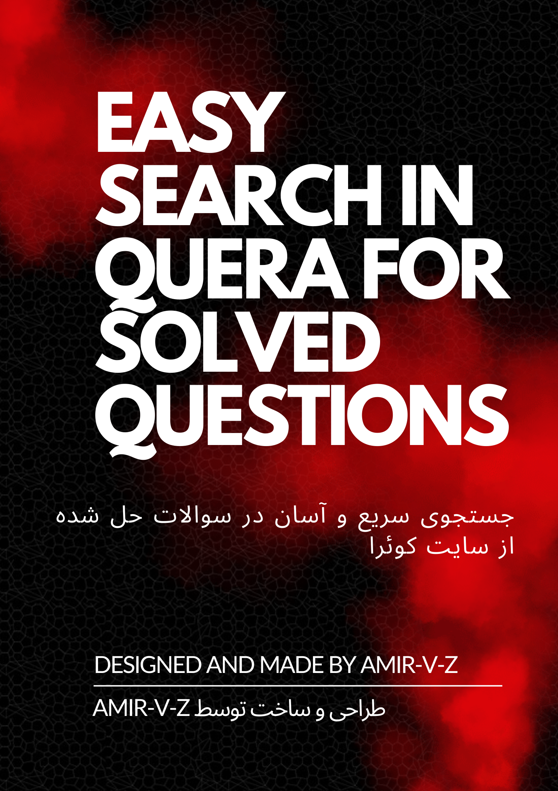
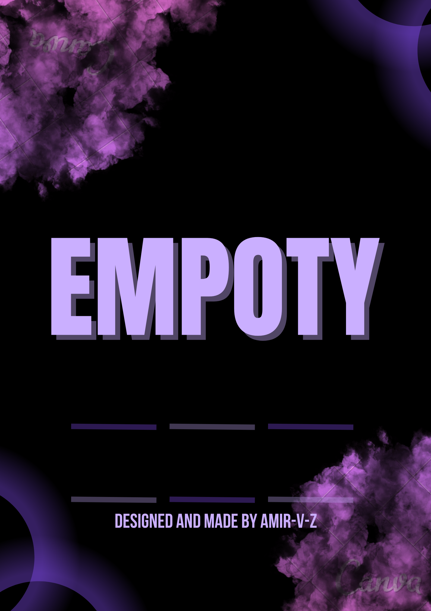
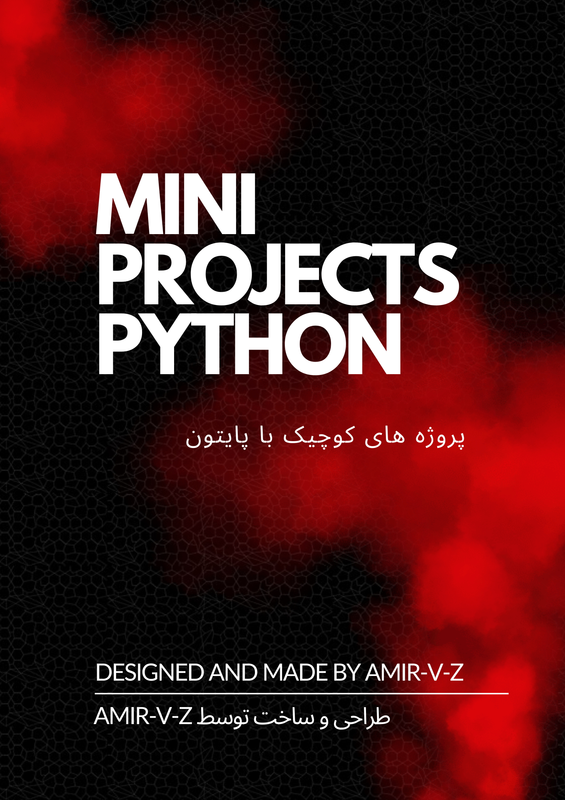
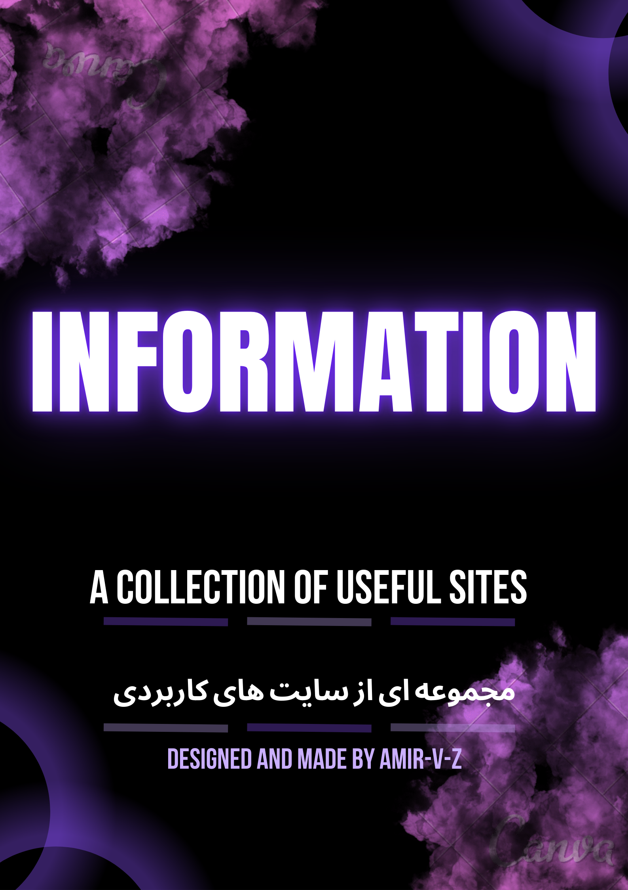
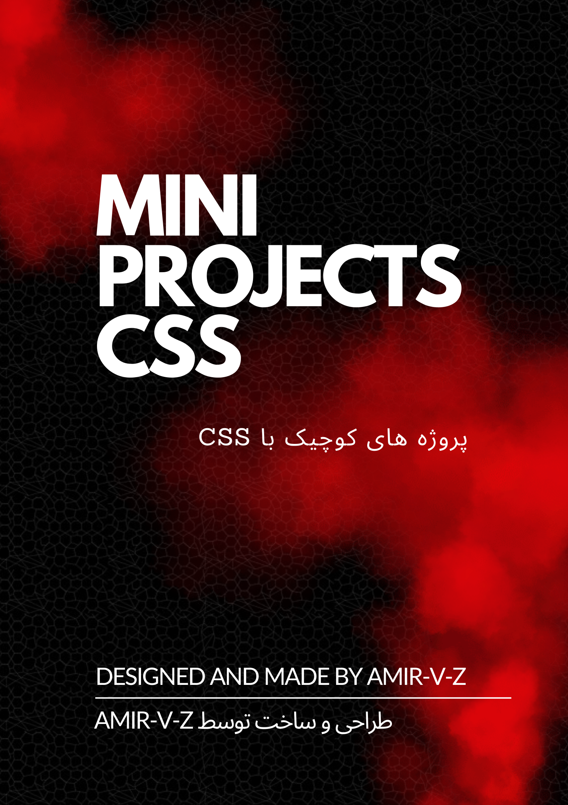

<h1 align="center">
  </img>
</h1>

<h3 align="center">
  
  About Me
  
</h3>

<h6 align="center">✔ A passionate Programming Language developer from Iran  </h6>
<h6 align="center">✔ Computer Engineering Student </h6>
<h3 align="center"><a href="https://quera.org/profile/amir_v_z">Quera</a></h3>

<h3 align="center">
  
  Languages
  
</h3>

  

<h3 align="center">
IDE & Tools
</h3>

  

  
  
  

  
  
  

  

<h2 align="left">🖋 Author </h2>

- <a href="https://www.github.com/amir-v-z">@amir-v-z</a>

