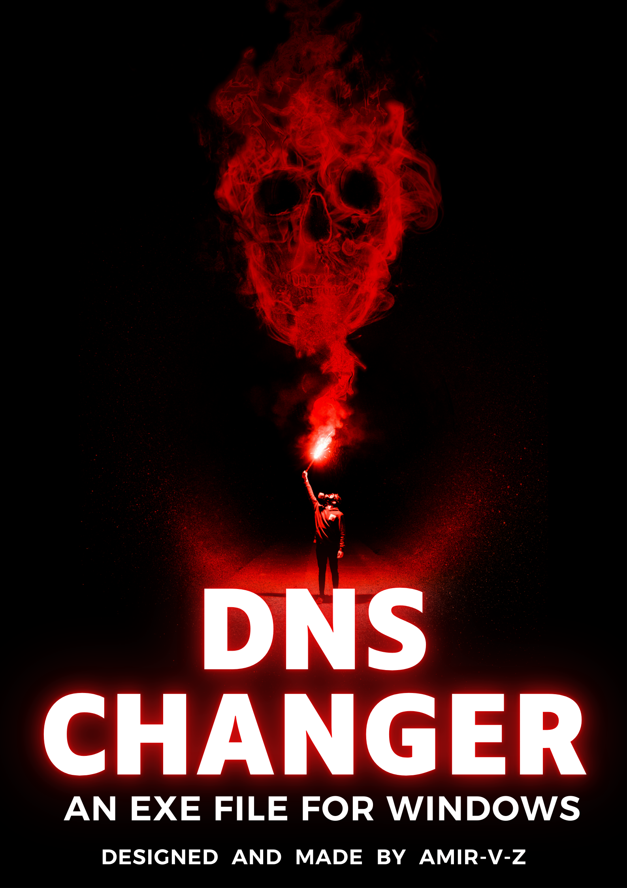
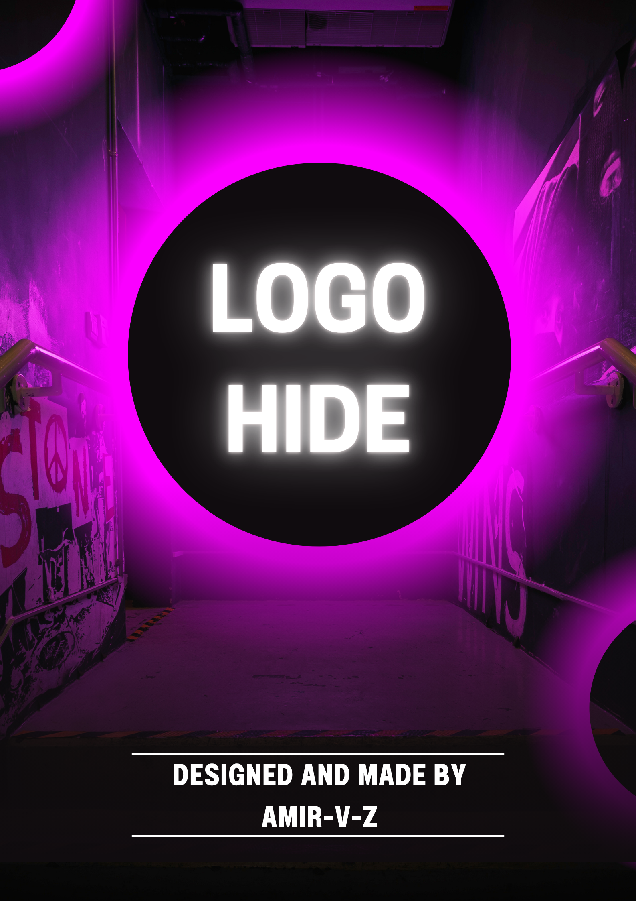

<h1 align="center">
  </img>
</h1>

<h3 align="center">
  
  About Me
  
</h3>

<h6 align="center">✔ A passionate Programming Language developer from Iran  </h6>
<h6 align="center">✔ Master's Student in Artificial Intelligence </h6>

<h3 align="center">

</h3>

<h3 align="center">My Other Profiles<a href="https://quera.org/profile/amir_v_z">Quera</a>  <a href="https://www.figma.com/@amir_v_z">Figma</a></h3>

<h3 align="center">
  
  Languages
  
</h3>

  

<h3 align="center">
IDE & Tools
</h3>

  

<h3 align="left">My Selected Repositories </h3>

- [Quera Answers](https://github.com/amir-v-z/Quera-answers/blob/main/README.md)
- [Quera College (Pilot Code Programming Basics)](https://github.com/amir-v-z/Quera-Programming-Pilot-Code/blob/main/README.md)
- [Functional sites](https://github.com/amir-v-z/Functional-Sites/blob/main/README.md)
- [Mini Projects Python](https://github.com/amir-v-z/Mini-projects-python/blob/main/README.md)
- [Mini Projects Css](https://github.com/amir-v-z/Mini-projects-Css/blob/main/README.md)
- [Mini Projects Js](https://github.com/amir-v-z/Mini-projects-JS/blob/main/README.md)

<h3 align="left">Mini Project :</h3>

  
  

<h2 align="left">🖋 Author </h2>

- [amir-v-z](https://www.github.com/amir-v-z)

